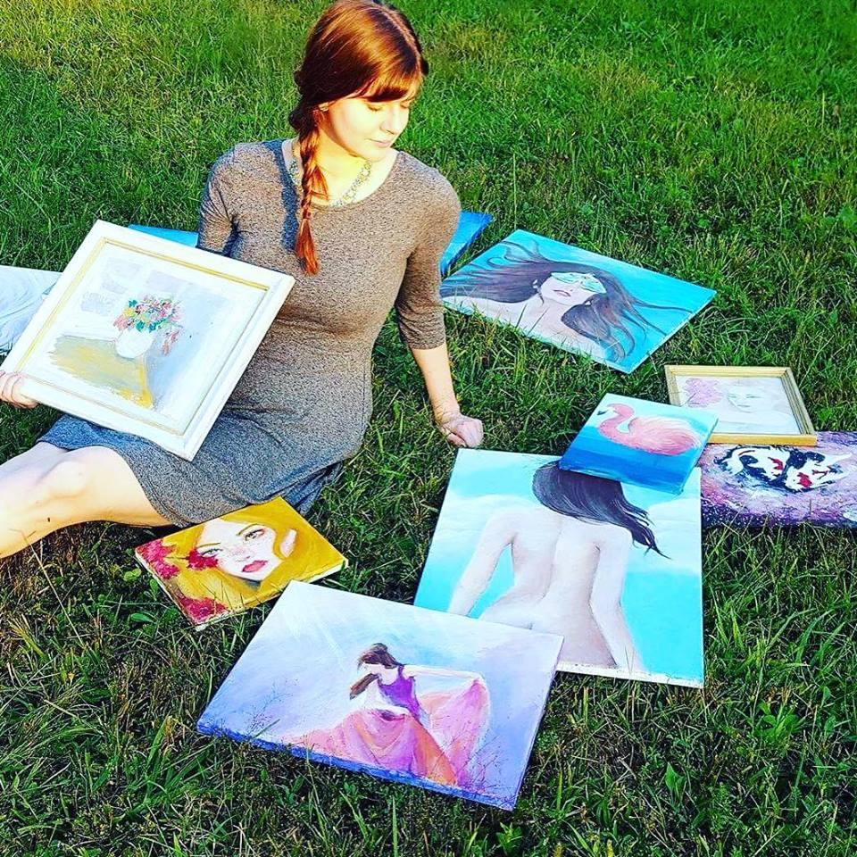
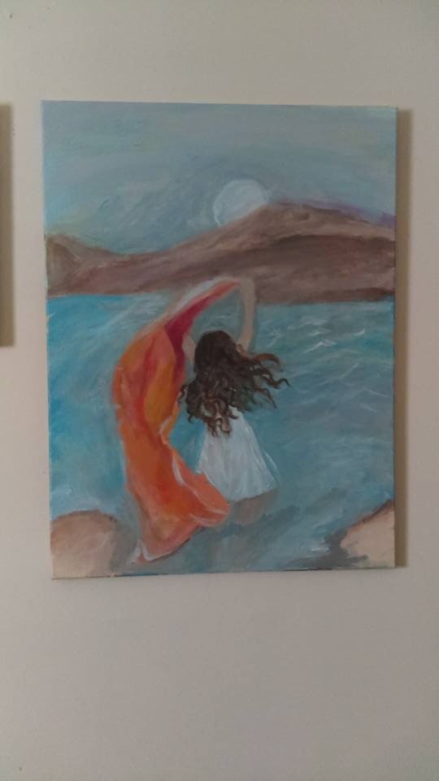
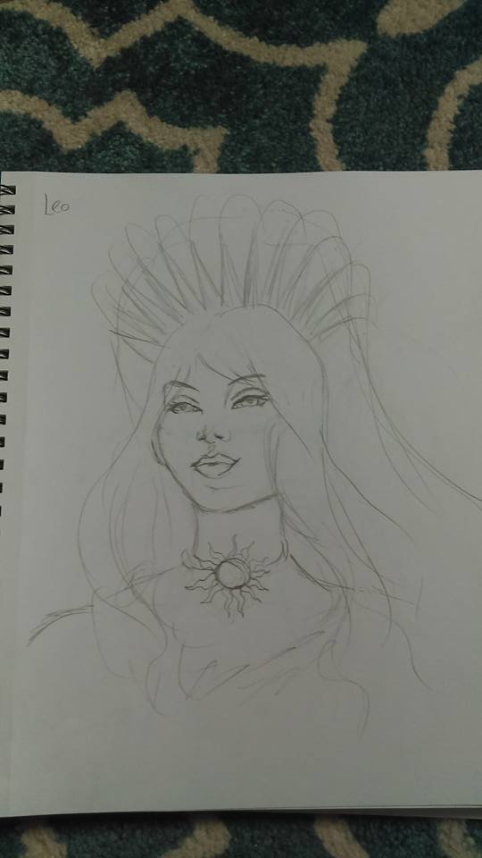
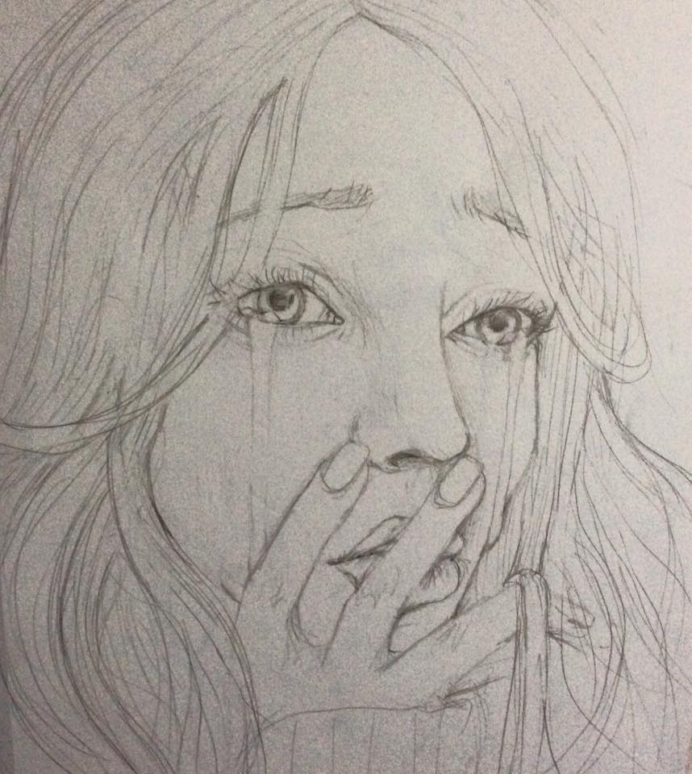
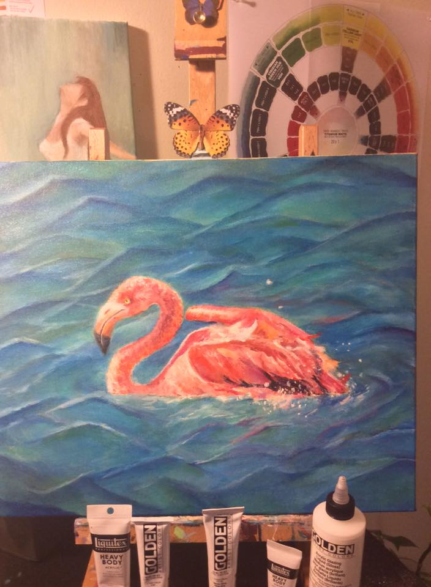
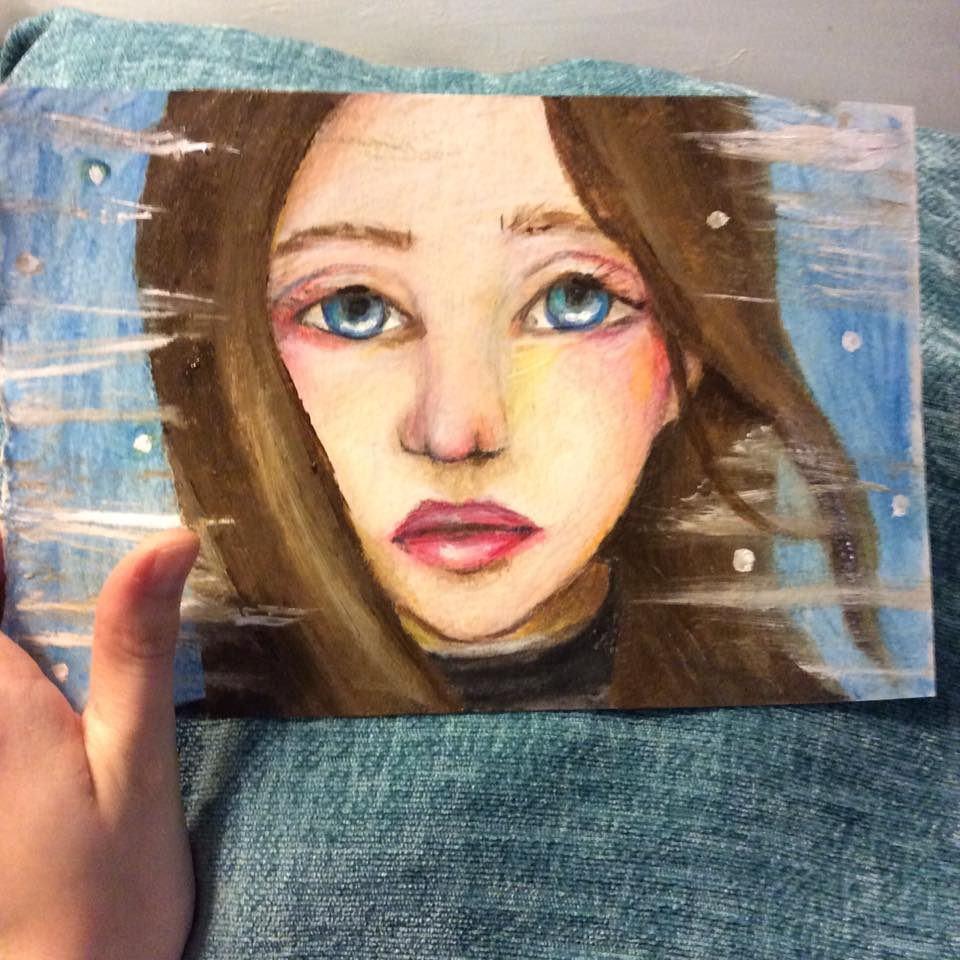
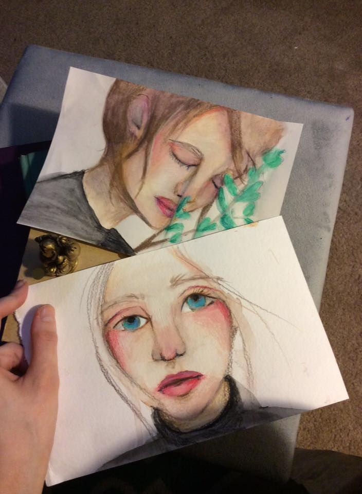
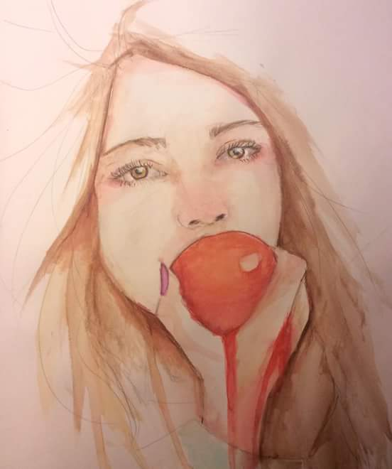
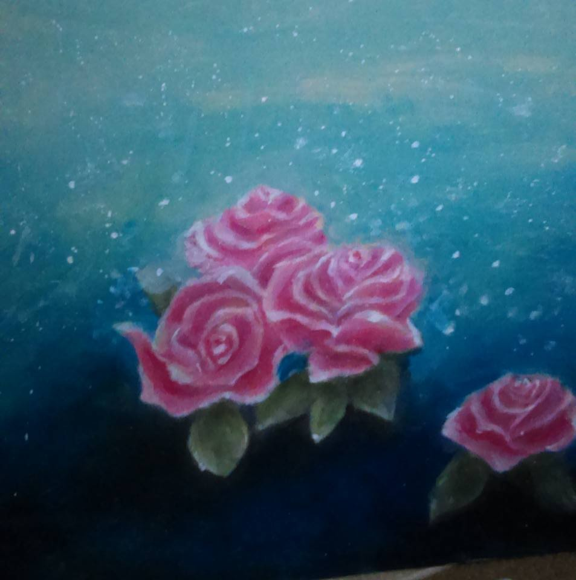

Spread love with AnMa! #FeelGood #ANMA

Art Credits:

<strong>Artwork: Lady Portrait  
Artist: Ashley Elizabeth Sego<strong>

[Ashley Elizabeth Sego's Page - Oxcart Art](https://www.facebook.com/Oxcartcompany/?pnref=story)

Enjoy & stay connected with us!

[Facebook](https://www.facebook.com/anxietymanager/posts/1101264269995794)

[Twitter](https://twitter.com/anxiety_manager)
