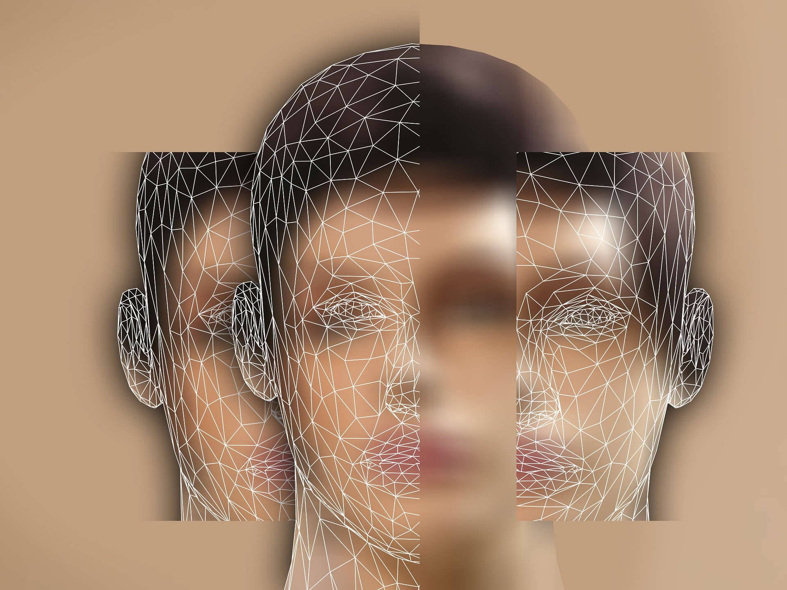

<h1>One cool way to Reprogram your subconscious mind</h1>

Last week my brother was driving me to some remote place of the city. We stood in traffic for some time. There was one vehicle that stood ahead of us. It had a picture of Indian god Hanuman painted on its rear. He was depicted as old.

My brother being a devotee of Hanuman said:”Why these people depict him as old? How do they know he is old?”

I asked him:”How do you know he is young?”

A moment later we were laughing.

<strong>Beliefs!</strong>

They hold you or propel you.

I am amazed at the control they exercise over every dimension of our lives. I am also saddened by the fact despite the crucial role they play in our lives they are least talked about in our academic institutions.

Why do some people dread certain situations where others would be comfortable?
Think about it.

Circumstances and situations are same for everyone. But how the mind of an individual processes them is what matters. And it is the only thing that matters. There is seldom a part of our consciousness that is not conditioned. Do you have spiritual beliefs? Then you perhaps have an image of god that you revere.

Belief is a state of certainty. It may have nothing to do with the reality but it might exist as a powerful subjective reality. There are some key insights about beliefs that I can share with you in this post. If you perceive the working of beliefs then you can go ahead and use my method to reprogram your deep seated beliefs.

1. Beliefs blind us. Not literally but figuratively. If you are thinking right now that change is not possible, it is your belief about change itself. Hence, quality of your conscious thoughts is determined by the unconscious beliefs that you hold.
2. Some beliefs work in a layered structure. For example, if you dread social gatherings, it might be because you had some bad experience in the past that is still unconsciously playing in your head. Now, I might advise you to not to care what others think of you because you can’t control them. This might sound logical to you but if you have developed some inferiority about yourself, logic won’t work. Maybe you have a further layer of belief that says parents are always right.  And you absorbed this belief from them that if you have some physical flaw then you are unfit for social gatherings. You see how multilayer structure of beliefs work.
3. Once a belief is deeply formed it will find more and more evidences to back it up.  Beliefs love evidences and this is one thing about them you can use to your advantage. Snowball effect is very applicable to beliefs.  Forming new beliefs takes persistence.
4. Rational thinking can only be turned into a belief if it is repeated enough with emotions. Emotions can be negative or positive. Positive emotions give you hope and negative emotions give you fear. Fear is very powerful. It can be used to your advantage.

You need to understand if beliefs are working in layers then you have to address all these layers. With attention and some experience you would be able to see these layers. I have one method that I use to reprogram my beliefs. Try it and see if it works for you. You can use this method to destroy any limiting belief that you might have. Trust me, change is possible and I insist you to become open to the possibilities. Here is my method:

1. First I delve deep into my limiting beliefs. I know my limiting beliefs when I am not okay with my reactions that are driven by those beliefs. I see all the layers.
2. For every layer I develop a rational solution.
3. I seek evidences in the world that back my rationalization. I imagine them in my mind as vividly as possible. This gradually convinces my subconscious mind. Remember this is all about convincing your subconscious.
4. Then I talk to myself about my limiting beliefs and evidences contradictory to my beliefs that convince me that I am wrong in my thinking. I talk to myself as if I am teaching someone. I talk with conviction.
5. I record this self talk in my phone.
6. I listen to it whenever possible. Repetition is the key. I listen to it with the same attentiveness with which I talked. I imagine while listening my own voice. Visualization is powerful.
7. I deliberately search for the evidences in the world to convince my subconscious of falsity of my thinking. Once this belief has gained adequate weight I won’t have to search for evidences. My beliefs will.
Once a belief is formed, you are done. You will no longer think and act according to your old beliefs. New beliefs will drive all your actions.
You are brand new now!

Remember, persistence is the key.

If you need any help, feel free to comment.

Thanks.

Spread love with AnMa! #FeelGood #ANMA

P.S.: User has given all the rights and permissions to post this on our page.

[Facebook](https://www.facebook.com/anxietymanager/)

[Twitter](https://twitter.com/anxiety_manager)