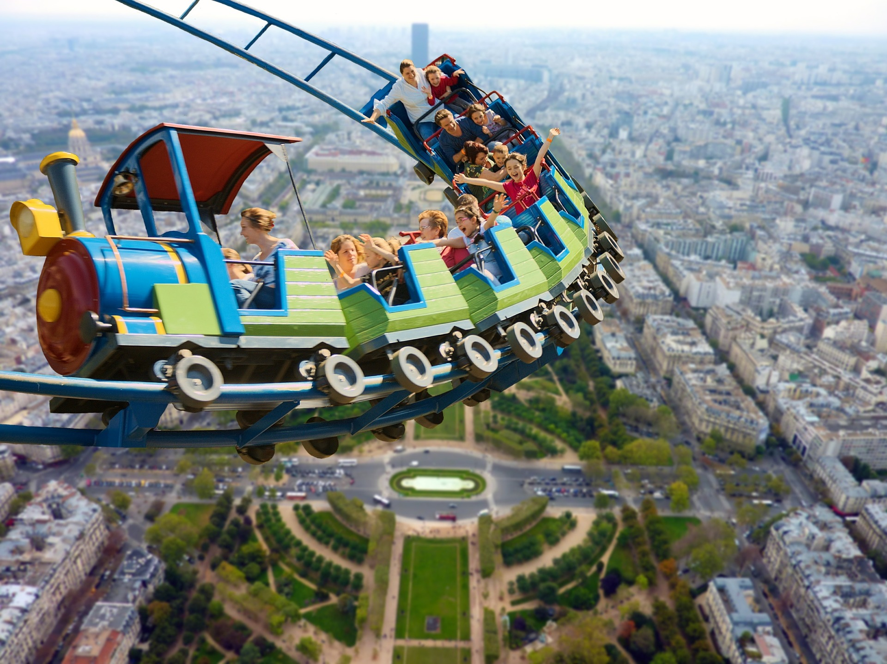

If I asked you if you wanted to get rid of your fears you would have nodded in yes. If I then asked you what had you done to get rid of those fears? You would probably say: “Nothing”. The question is-**why**?

You see someone doing something that you want to do, you secretly say to yourself “I wish I was doing it also!” and carry on with your life. Why are you not doing it? There is one reason-**Fear**. What else could it be otherwise? There is nothing that we would not do if we had no fear about doing it. But the problem has got some powerful hidden causes that work under the surface. I feel great to share one powerful realization that came as an epiphany to me.

You know what? - **You don’t fear your inadequacies; you fear your unbridled greatness!** I am not throwing some philosophical shit here. I will prove my point.
Since childhood we have been conditioned by parents and society to live according to the so called “norms”. We live by these norms. Now, these norms are not based on the reality. These are ideologies and in a way we all are little fundamentalists. When you were a kid, you were taught by your parents not to “overact” when you started dancing for apparent no reason. Since you wanted their acceptance, what did you do? You stopped and created a belief that dancing out of joy is not socially acceptable. This is just one example. There are thousands of such beliefs you have cultivated so that you would “fit in”. Now, remember that moment when you danced. If there was no one around to judge you, you would simply be expressing your inner joy. But expressing joy is seen as “flaunting” and you don’t want to flaunt because it is unacceptable in the society you grew up in. There was nothing wrong inherently in dancing. You were not killing someone.

Such other ideologies like girls should not wear “small” clothes because it attracts the attention of men have been used as an excuse to rape them! All I am saying is we all are living in well entrenched mental grooves. We have left very little room for intelligence.

We fear doing many things that we want to do because we subconsciously believe that it may upset other human beings around you. Since you don’t want to lose their acceptance it is always “safe” to remain in the self created prison of “security”. But does living in this security actually do any good to you? No- because you secretly hanker for those desires. You secretly want to live with the confidence but you don’t because it attracts the attention of those who despise it. You may not be living the life you want but the desire still lives under the surface and when you unjustifiably judge others for doing something, know that you secretly want to do what you are judging. You just don’t want others around you to become insecure and hence you choose to remain safe and respectable.

Now you have to choose.

1. Do you want to be respectable and suppress your creative desires?
  OR
2. You want to live your creative desires.

If you have chosen the first one, then let me tell you one fact: ***Nobody gives a shit if you die tomorrow with all your desires in your heart.*** They will talk and forget.

If you have chosen the second option then you must put this desire above **your need to conform.** This path sounds dangerous (it is psychological fear) to you but what do you want? Regret for not doing something your heart desired or respectability? And let me tell you if you let go of respectability which is hollow anyway; this very act will unleash infinite potential that has been lying dormant in you to do what you want to do. And then starts the real growth. Whenever any fear creeps in, just remember I am greater than my fears because you are. There are some pointers that I want to bring to light:

1. You fear what would happen if I do this? Remember, whatever happens you will handle it. Feel good about it. If you see, you have handled so much till now. What makes you think that you won’t be able to handle if anything comes? Life doesn’t stop. You will have to move on despite all your fears. You can’t predict the future. Safety doesn’t exist in the real world.
2. Realize that the present moment is the only reality and there are infinite possibilities that are not in your hands. Feel the fear-do it anyway. Remember, trying to getting rid of fear is foolishness. Fear is not going anywhere. It is all about how you manage it. More you fear your fears more they are reinforced! You see, there is no real security in them.
3. Fear has an intention. It wants to keep you safe. You will have to choose either one of these- growth or fear. Though world may be dangerous out there, you can only grow when you face it and do the things that you want.
4. Use your intelligence. Real intelligence is infinitely fluid in nature and it does not conform to any ideology. It transcends all beliefs. It always knows the best course of action that needs to taken in a situation. Children have this intelligence.
5. Fear can never be dealt in mind. It is always in future and it is the product of thought and psychological time. It always remains out of reach of your hands. It can only be dealt in the present moment. If you are already fearful of upcoming danger how would you deal with it when it actually happens? You will have to deal with it anyway. Why not deal with it courage?

So, it boils down to this fact: “You know if you let go of your fears that are the results of your social conditioning, you may not be acceptable anymore. And if you relinquish the need for this acceptability, you unleash the giant within. You don’t fear that you lack something, you fear losing acceptability if you unleash this greatness within you. You fear you won’t be able to relate anymore.” You have to choose. It is not anyone out there who stops you. It is your own beliefs that stop you.

**“Life can only be lived dangerously, there is no other way.”- OSHO**

Spread love with AnMa! #FeelGood #ANMA

P.S.: User has given all the rights and permissions to post this on our page.

[Facebook](https://www.facebook.com/anxietymanager/)

[Twitter](https://twitter.com/anxiety_manager)
