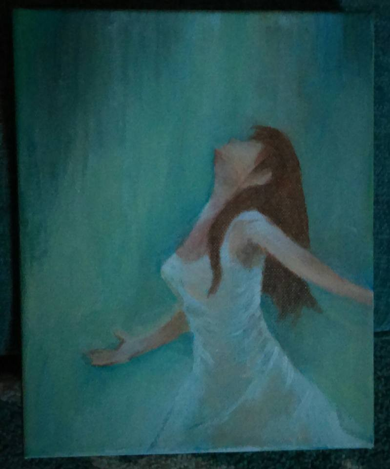

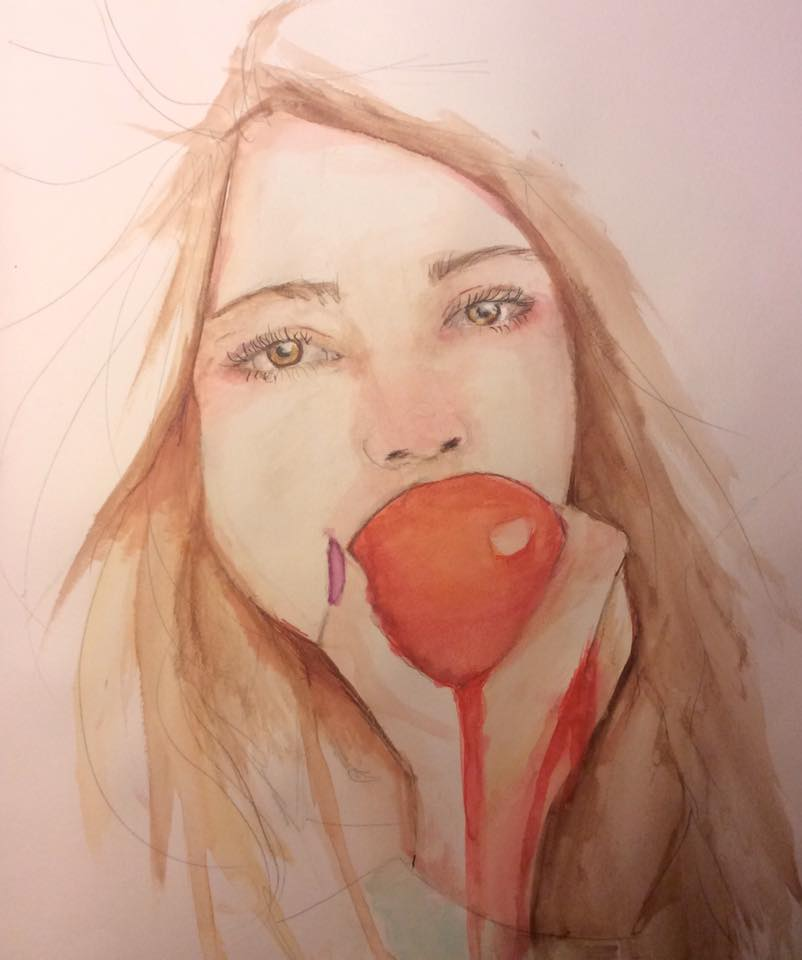

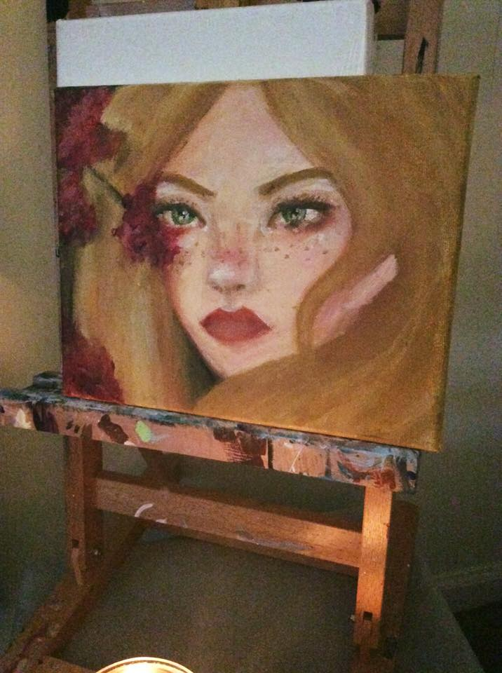

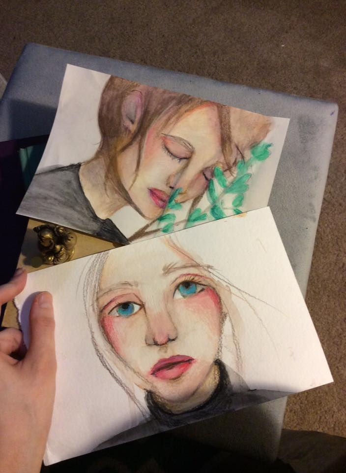

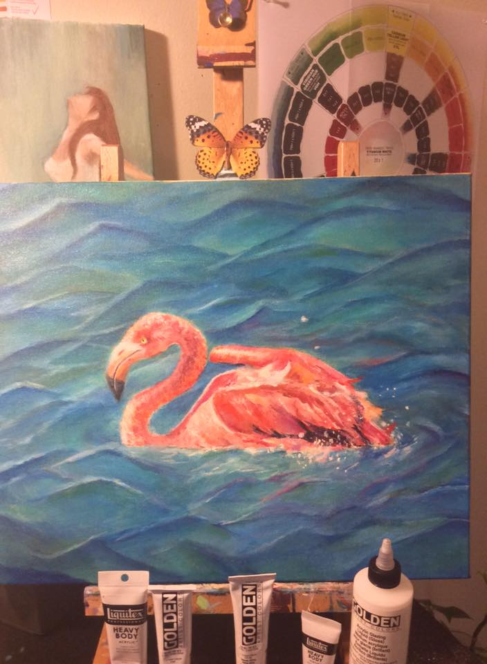

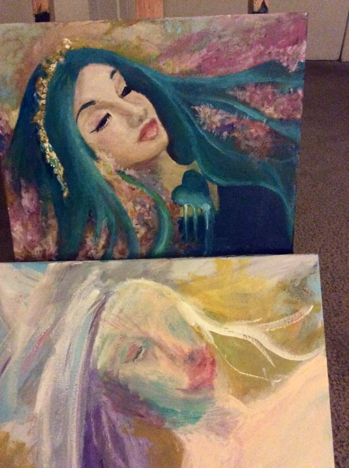

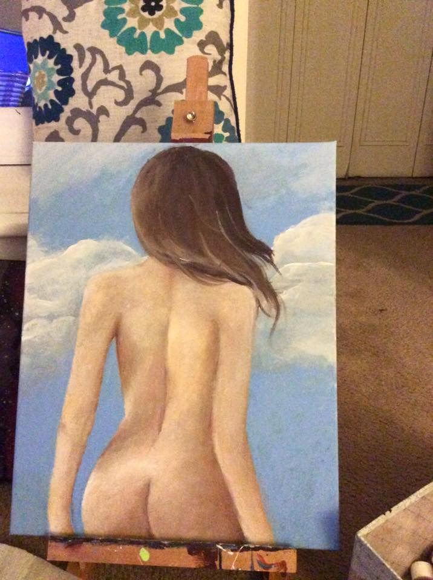

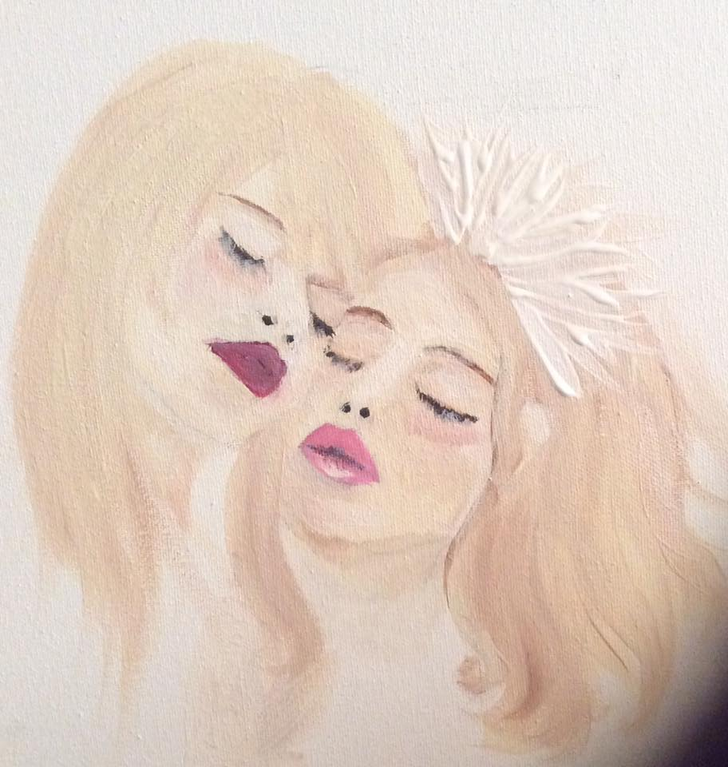

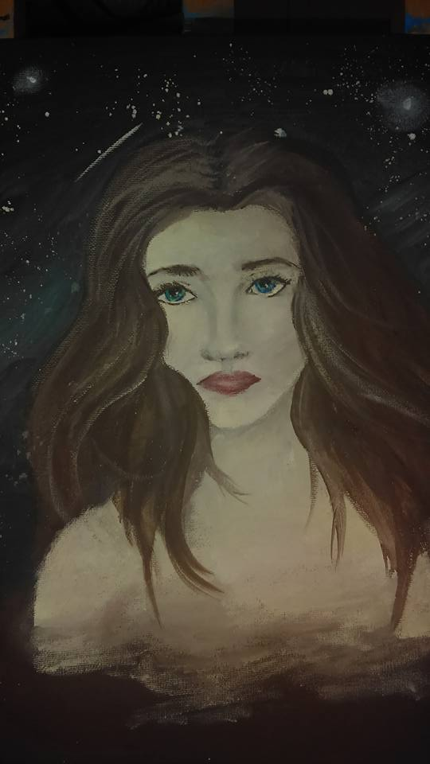

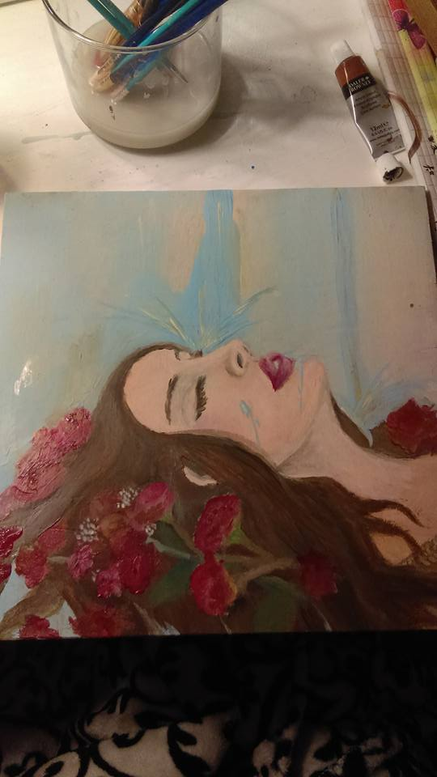

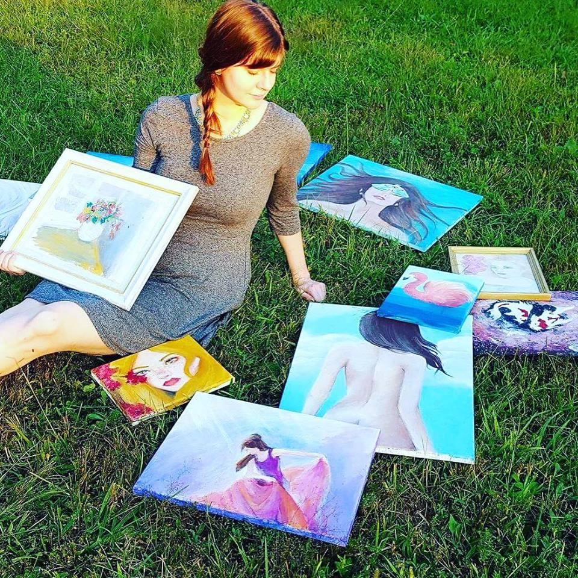

 
***To decorate your world with above painting,  purchase here: [&#x1F49C;Ashley's Oxcart Art Shop&#x1F49C;](https://www.etsy.com/shop/OxcartArt)  NOTE: Author only sell originals, so once one of her pieces is gone, it's gone! So get them while you can.***

Spread love with AnMa! #FeelGood #ANMA

Credits: 
Artwork: Ashley 
Music: blue.haired.girl.project 
Logo Design: Thunar 
Sound effects: Brendon 
Video: SSV

Enjoy & stay connected with us!

[Facebook](https://www.facebook.com/anxietymanager)

[Twitter](https://twitter.com/anxiety_manager)
