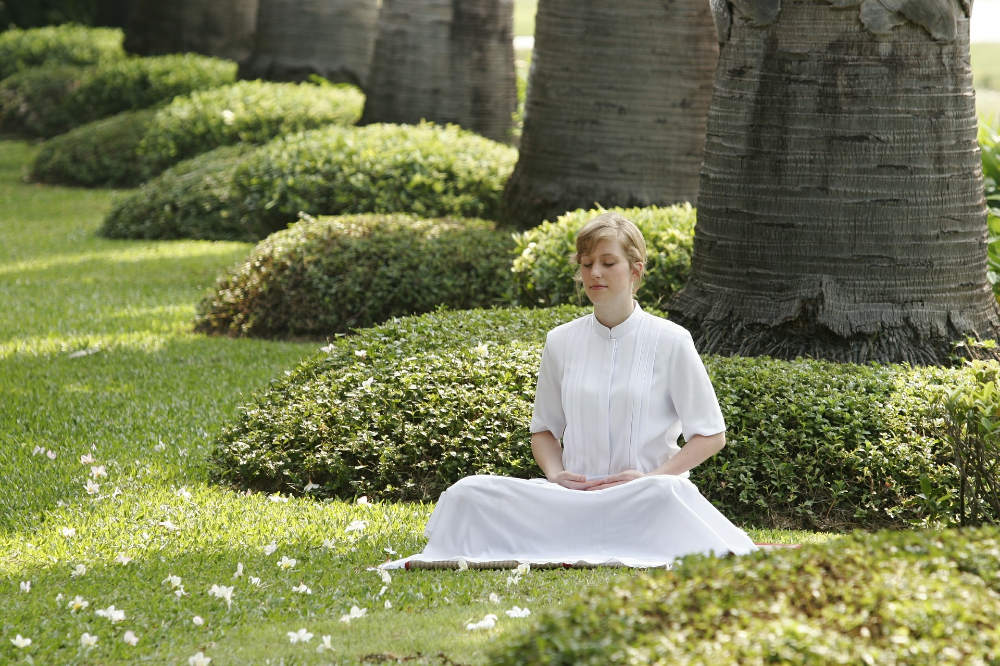

**What meditation really is? - Biggest myths debunked**

Meditation- a widely discussed subject-yet least understood by the majority of human beings! What is meditation? You want answer to this question? I, after much suffering and pain, have come to know it is just a fancy term for **SURRENDER**. In this post, I am going to reveal you something that has power to change your perceptions about meditation forever and if you understand what I convey here, you can choose to remain in meditative state 24 hours a day, seven days a week; if you would like that. I request you to not to take these words literally and turn them into some concept. Surprisingly, there is nothing much to know about meditation. You can understand it now or you might take forever. It is so deep yet so simple. I am also going to reveal you some tips that can help you achieve this meditative state easily. Please bear with me.

First, I am going to tell you what meditation is **NOT!** Some of these pointers might shock you but it will be for your own good.

1. Meditation is not a concept: Meditation is not a concept. If you believe that it is a concept then no matter what I tell you here you will not understand what meditation really is and you will simply create another concept other than you have held till now. It is far beyond “should’s” and “if’s’. If you are stuck in “Should” then know that you are being conceptual about it and it is not meditation. And whatever is being told here is not meant to be taken as a concept. It must be understood and not crammed! Now, don’t cram ***“Meditation shouldn’t be a concept!”*** because you are again stuck in a concept the moment you say this! Holding concepts about meditation is what **mind** is really good at. See this trap! How many concepts do you have about meditation? I want you to calm them while you read this. Be open.

2. Meditation is not a mean to “Something”: Yes! It is not a mean to anything! Doing it won’t make you happy. It won’t make you peaceful and joyous. Rather, these are the natural consequences of being in meditation. I would elaborate this point as it is quite subtle. See, you do many things with an end in your mind. You study for an exam with an end that you have to achieve “A’s”. So, you start preparing now. You study. You give exams and some days later, the results come. The result depends on infinite factors other than your performance in your exam. Now, I don’t care what your performance is or what factors have affected your results, one thing is sure-cause and effect is at play. You see the “effect” because of infinite “causes”. Meditation is not a cause to any future effect. If you think ***“let me meditate, and achieve peace”*** you are being duped by your mind. Know that. You may say: **“But meditation gives peace!”** and I would say: ***“Peace is your nature, meditation has just uncovered it-there is no time gap”*** as we see in “cause” and “effect”. So don’t try to achieve anything through meditation. Don’t seek anything.

3. Meditation is not about a particular technique: There might be infinite so called “techniques” to meditate but the real essence of meditation transcends any technique that is out there in the world. Don’t get fooled by anyone that it has to be done using a particular technique only. ***Catch the essence of it-it would be more than enough.***

4. Mediation is not concentration: Well, it is not concentration. Concentration is about training your mind to focus at something you desire it to. Some people think that meditation is about focus. It is nothing but another concept about it.

**So, now you know what meditation is not!** 
What is it then? 
Answer is: **“Surrender”.**

I know that your mind has already started making interpretations around this word. It won’t be wrong to say that you have already judged: **“What! I won’t surrender! I am not weak”. For all those who have interpreted it, bear with me.** And if you have so many thoughts rushing around this word “surrender”, stop right now and come back later to read it again. The reason is- you have perhaps got your defenses active and you might interpret it subjectively if you continue to read it further. That would be useless. For those who have been open till now can continue to read and I promise you won’t regret it.

The word “surrender” here is not meant to surrender anything **“physically”**- neither your body, nor your **“possessions”**. It is about surrendering your **ego** that is inside you. Why would you do that? For one simple reason- To uncover your true nature that is **peace and fearlessness.** Right now, you are being controlled by your mind. If you get hold of your mind, you will not succumb to its traps and won’t do the things that might bring inner turmoil for you and others. I am not an expert or preacher. I am just a human being gaining more clarity that I intend to share with you. Even I get trapped occasionally into mental traps, nevertheless I am improving. I know I have a long way to go. It does not matter where you are right now, what matters is -whether you start now or not.

The essence of meditation is-**“To surrender to what is”**. What is **“What is?"** It is never **“Should”** because **“should”** is not a reality; it is always in future. It is an illusion created by mind to create time and suffering. **“Should”** is another name for **“resistance”** and it is what is creating all the miseries in everyone’s life. The moment you start chasing **“should”**, know that you are going away from what is now and is real.

Are you angry? Be angry. Don’t **“Why am I angry?”, “I shouldn’t be angry”** or any other justification related to anger. Anger is real at this moment. When you justify your anger in any form you simply create a resistance to what is! See this fact in yourself. Now, though you are angry, you choose not to speak in front of someone as it might lead to other problems, you know it. I would say it is an act of intelligence. Now, if you say, I didn’t say anything out of rage because it might harm me then you are speaking a fact which is real. But if you say:” I didn’t say because I could have spoken something that might hurt him or her” then you are not being real-you are creating conflict and resistance to what is. Now, if you could this hypocrisy in you and know the truth-you are meditating. You are not lost in the thoughts and not creating imaginations in your mind. If you are not in the past or future or even if you are and see that you are, you are meditating. What happens now? When you observe the tendencies of your mind with awareness, you become detached from it and-no matter who you are inside. This detachment brings sense of presence and gradually you realize that you are not your mind and you start gaining control over it. Now, you won’t fight “what is” because you know it is utterly futile to do so. Even if you do and get lost in the mind, become aware that you are resisting. This is what the reality is. When you accept **“What is”**, it loosens its grip from you and you become free. But if you fight **“What is”** you would realize that **“What is”** has turned into **“What was”** and now you are trapped because resisting memories is of no use. It only intensifies them and creates greater havoc in mind and life if they are dreadful.

***Freedom is nothing but “being with the reality” and not resisting it.***

So **“Don’t try to get rid of anything. Don’t try to become anything”**. If you see the fact that trying to become anything or trying to get rid of anything is an utterly foolish act, you will be meditating. It would save you from all the mental turbulences that you are going through. Through this one example I have tried to explain the essence. You can apply it in any area of your life. You will gradually find that you are gaining control over your mind.

There are some tips that may help you remain in this meditative state:

1. Never overeat: There is a reason why spiritual practitioners emphasize the importance of fasting. Eating light and healthy keeps your mind calm and let you see things clearly. Remember the connection between mind and body always.

2. Drink more water: Brain works better when body is adequately hydrated.

I respect your opinion too, and if you like my article then please take some pain and write a thank you note in comment section. :) or share your views.

Spread love with AnMa! #FeelGood #ANMA

P.S.: User has given all the rights and permissions to post this on our page.

[Facebook](https://www.facebook.com/anxietymanager/)

[Twitter](https://twitter.com/anxiety_manager)
