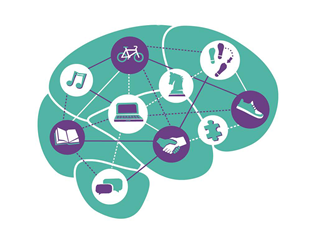

**A Tale of Two Brains**

It said that men's minds are made up of little boxes. They have a seperate box for every thing. They have seperate boxes for kids,wife,money etc. For instance when you talk to them about cricket, they open their cricket box. Similarly they have small boxes for everything. And then they have a NOTHING BOX.Where they are most comfortable. Thats why when asked that what are you thinking,most men reply nothing. They are quietly sitting in their nothing box and relaxing. This is their way of destressing. Thats why when stressed men dont like to talk. They just keep quiet and sit in their nothing box.

While women's minds are made up of wires. Each wire is connected to the other, like a network. Those wires run with emotions. That's why women can connect so many things at one time. Thats why women are good at multitasking. Running homes and doing office work so perfectly. While stressed, women like to talk about it as they try to connect all the wires.

You can watch the video here:

<iframe width="560" height="315" src="https://www.youtube.com/embed/3XjUFYxSxDk" frameborder="0" allowfullscreen></iframe>

Spread love with AnMa! #FeelGood #ANMA

Source: Internet

[Facebook](https://www.facebook.com/anxietymanager/)

[Twitter](https://twitter.com/anxiety_manager)
