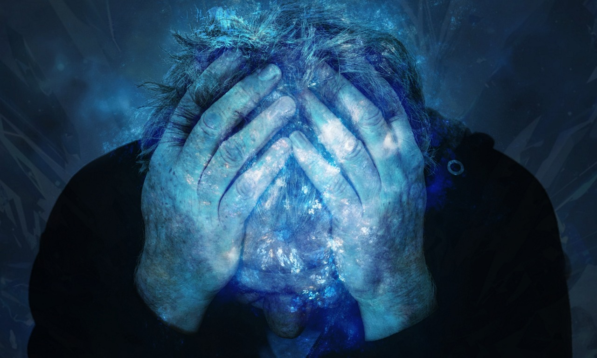

<h2>Depression:</h2>
<h4 style="margin-left: 5%">feelings of severe despondency and dejection.</h4>

Well, I think I am well qualified to discuss about depression.

I had been in depression for almost 3 months. It was hell, I can say.

But now, I am out of it. And I have some powerful lessons to share that I learned during this phase. It is not a disease and anyone can conquer it. I am a live testimony of this. I did not need any active medical intervention.

I can say my mind had become a machine that could only produce negative thoughts and emotions. If you are in depression, you would usually have these symptoms:

1. Lack of hunger. It happened to me. My appetite had plummeted.
2. Not feeling like doing anything. You lose interest in the activities that you used to enjoy.
3. Indifferent to everything happening around you. Yes, if something negative happens, it only makes you more depressed. It seems like an endless abyss.
4. You want to be alone. You don’t want to engage in any conversation. The paradox is, more you sit alone, worst your depression becomes.
5. Recurring feelings of being trapped and hopelessness.
6. Every thought that comes to your mind is negative. There is no room for positive thought. You constantly feel bad.
7. You have started to believe that nobody can ever take you out of your depression.

Well, considering the last point 7, that’s true. It is your mind. Only you have power over it, nobody else. And depression is nothing but a state of mind. There is nothing wrong outside. Understand this.

The worst part is, only you know what you have been going through. Nobody would really understand your mental state. Don’t worry. It is not their problem. It is your problem and you have to come out of it. Don’t even try to act on any suicidal thought that you might occasionally have. This is not a permanent problem. It is just current state of your mind. That’s it. You will come out of it. Eventually.

You need to understand something about depression. I do not know whether your genes have any role to play here or not. Your psychiatrist might guess that.

1. It is a state of mind. See, everybody has negative thoughts for once in a while. But people with depression have them recurrently and in abundant amount.
2. People with depression are not mentally weak. They are just going through a bad psychological phase.
3. The thoughts appear damn real! A depressed person can’t make out the difference between his thoughts and reality.
4. It is not a mental disease. NO! NO! NO!. If it is a disease, then everyone who has negative thoughts is a diseased person.
5. It is not permanent. Mark this one.

Now, I am going to tell you a powerful lesson here. Pay attention:

***“ Mind and body are connected.”***

Once again:

***“ Mind and body are connected.”***

I don’t know how you have reached to depression, I want you to take responsibility of your current state now. Don’t blame anyone, not even yourself. Don’t blame circumstances. It is your mind that is doing the trick. Let me elaborate the lesson that I have learned.

See, when you think negative or positive, you must have seen the impact of these thoughts on your body accordingly. Right?

Also, you must have seen one more thing. The way you carry your body also impacts your mind. Walk like a shrimp. And you put yourself in a negative state. Walk with your shoulders up. You feel confident.

You are in depression right now. Your mind is heavily loaded with negativity. It would be next to impossible for you to allow a positive thought into your mind. I can say you have little control over your mind right now. But you know what? You have one thing in absolute control. ***Your body. Use your body to tame your mind.*** I know it sounds contradictory because I just said- “Mind controls body”. But please add one more thing to that ***“ Body also controls mind.”*** It goes both ways.

So, what I am strongly recommending you is (I know it takes little will power but if I were you, I would have done everything possible to get me out of this mental hell):

1. Do something that engages your mind. ***Absolutely important.*** You know why? It keeps your mind off of your depressing thoughts. And gradually, your mind will come out of autopilot. More you bring your mind out of autopilot, lesser it tends to fall back to old ways of thinking.
2. Resolve right now that you will get up every morning and do some physical workout. Doing some physical workout will release feel good endorphins in your brain.
3. Do anuloma viloma pranayama at any cost. Learn the right technique. This pranayama has very calming effect on your mind.
4. Do yourself a favor by learning mindfulness. Do it daily.
5. Try to be with people. Don’t sit secluded. THIS IS IMPORTANT. If you stay alone, talk to someone. It would be even better if you could talk to someone who would understand what you are going through.
6. Instead of taking allopathic antidepressants, use ayurvedic medicines like Ashwagandha. I have found it very effective. Antidepressants do have negative impact on your body.
7. Take proper sleep. Sleep deprivation actually makes depression worst. One important tip. Never use your bed to lie down and think. The reason is your mind associates bed with thinking. You must only go to bed when you are really sleepy. If you meditate and do pranayama, it will be easy for you to fall asleep.

If you follow these tips religiously, your mind will gradually lose its grip over you. Remember, ***YOU ARE NOT YOUR MIND.*** When it happens, you can resolve those mental issues that cause you to think negative. You should resolve them at any cost as your mind becomes calmer.

***Author: Pankaj***

Spread love with AnMa! #FeelGood #ANMA

[Facebook](https://www.facebook.com/anxietymanager/)

[Twitter](https://twitter.com/anxiety_manager)
