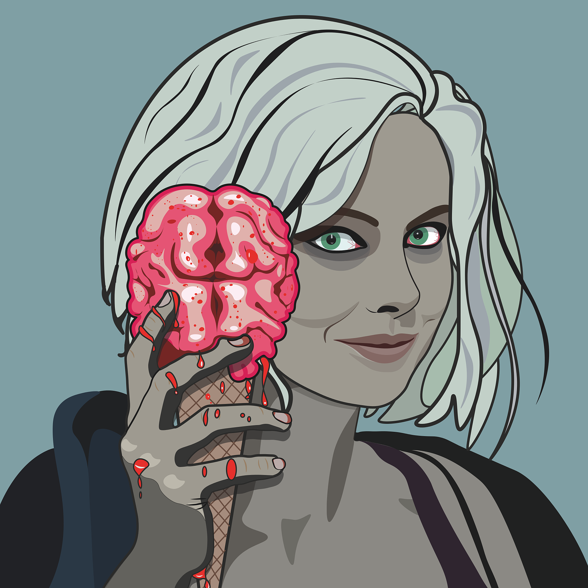

<h4>Image: iZombie CW TV Show</h4>

Most of the time, we are looking for answers of many questions but that set of questions has only ***One Answer.***

So, if you are looking for answers of below questions:

1. How to increase your vocabulary?
2. How to overcome your sadness?
3. Why it's so much difficult to learn new things?
4. Why luck isn't in your favour or helping you?
5. Why it's so difficult to remember things?

And many more such questions, just keep reading. You will be able to answer them by yourself.

To understand all of those questions, you should first know the answer of below question:
 ***How does brain works?*** 

One more thing, I am neither a student of **Biology** nor **Psychology**. It's  my personal experience that I am going to share it with you.

If you're too lazy to read, you can watch the animated video here:

<iframe width="560" height="315" src="https://www.youtube.com/embed/3l4e1CDGKrw" frameborder="0" allowfullscreen></iframe>

Let's discuss it with an analogy:

Think of your brain as a water tank.

As water tank of your house has lots of resources for filling water inside it, like using rain water, motor, pump, and many others.

In a similar way, our brain accepts knowledge from various sources like TV, books, newspaper, and many others.

Now the important part, as water tank serves different parts of your house like garden, bathroom, and kitchen.

Water tank = Garden + Kitchen + Bathroom

In a similar manner, knowledge present in brain is shared with conscious, sub conscious, and unconscious mind.

Brain knowledge = Conscious + Sub Conscious + Unconscious mind.

So, now understand below points, then ask any question from yourself and you have the answer for it.

1. The more you water the plants, or more you clean the bathroom, or more you use water for drnking, results good for you. It means, more you use your brain thoughts, your information will get revide and you feel easy to learn the things, as they stay in your conscious or subconscious mind.
2. So, if you don't water the plants or drink less water, it results in bad. In a similar manner, if you don't use your brain information then it will get store in your unconscious mind more like dead info.
3. Once the tank is full with water, and we try to add more fresh water to it then first we must need to make space by emptying it, else it will overflow. In a similar manner, to learn new things you need to keep revising old things and make place for new things.
4. If you close the connection for fresh water to enter the water tank, the tank will give birth to viruses or bacteria after short passage of time. In a similar way, if you don't accept new thoughts then your brain will have bad viruses too. So, to overcome your badness, accept the bad things happened with you, don't isolate yourself, and embrace them. Make place for new information to process for brain to stay healthy.

***Conclusion:***

1. If you want to learn new things, repeat them daily atleast for 5 mins.
2. Keep adding more information to your already learnt thoughts.
3. Make room for fresh water(thoughts).
4. Don't isolate yourself with the negativity.
5. Share your knowledge with others, like we shared in this article or video.

Thank you for reading.

Please like and share, if you enjoyed it.

Spread love with AnMa! #FeelGood #ANMA

[Facebook](https://www.facebook.com/anxietymanager/)

[Twitter](https://twitter.com/anxiety_manager)
