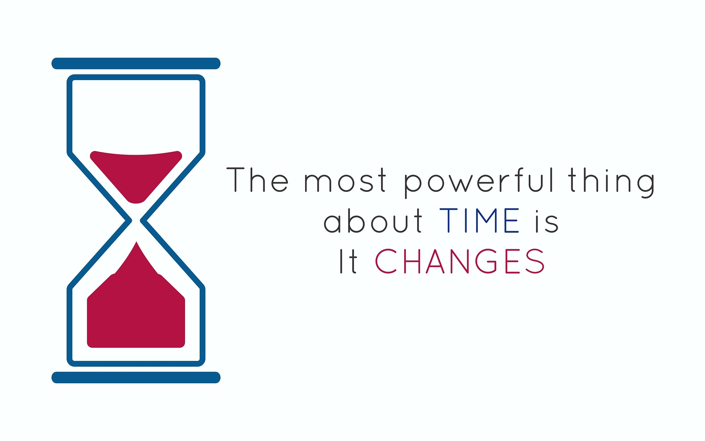

***The best preparation for tomorrow is doing your best today. ~H. Jackson Brown Jr.***

This is the story of a father named Time and of his twin sons named "beginning" and "ending", who never met each other, although they are very close to each other. They follow each other very closely.

Everytime we look at nature or around us, we observe that it is the God who wants these brother to live apart from each other. But we as humans, has the power to bring them together.

We started believing that to make a room for "beginning" new things in our life, we should call "ending" first. Once "ending" leaves, only then "beginning" arrives. But this statement is not completely true. It's a myth.

Let's start with my story, and ends with some questions for you, because you should have the answers by yourself that time.

After spending 12 years of my amazing 🏫 (school) life, I was excited to begin my college life. As everyone does, I even planned for doing outstanding activities, meet new people and fall in love with someone. But the truth is, things never happened as I planned. Somehow, I passed those 4 excruciating years of my college also and hoping for a better life as a professional. With the end of college life, there is a beginning of professional life. And this time I felt that with power of money, I could gave the beginning as I desired. And tada, it was not went like that. So, if we look back at the incidents of life, we always waited for something to end, to begin something new. Believe me, that's the blunder of life, and instantly, work on it to fix it.

As most people believe in this approach, they want something to end before beginning the new things, and that's one of the many reasons of their failures. So, if you have to meet the brother beginning don't wait for the brother ending to come. Make a room for beginning and you are on your success path. The results will come on time, but never lose hope and wait for the beginning.

If I haven't waited for the end of something to begin with new one, then I should really have achieved something extra in my life. Some of the question I would request you to think upon, ask yourself:

1. Did I ever wait to end something before beginning to trust my close ones?
2. Have I ever waited for something to end before doing anything that I would love?

That's it. I tried to justify my statement, and it's my personal view and respect your views too.

Spread love with AnMa! #FeelGood #ANMA

[Facebook](https://www.facebook.com/anxietymanager/)

[Twitter](https://twitter.com/anxiety_manager)
