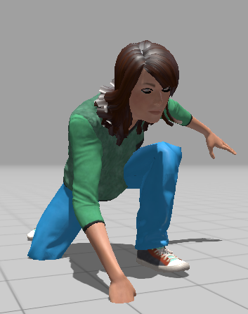

<h2>This post is not about me, its about you - My superheroes or superfriends.</h2>

<h3>You can find the list of heroes in credits section</h3>

Some kids are born while watching movies of genre romance, love, and accordingly build the talent of making love with everyone (devil).

Some lads spend their childhood watching action movies, and develop their interest in making biceps and chest, indirectly, a good shape of body.

And, few are like me, who brought up watching the superheroes movies. We, the fan of superheroes, are always in hunt of finding their heroes and angels throughout our life. And lucky me, I have found my superheroes. They are not just the names in my life, they are someone special that are hard to describe in words.

**What doesn't makes you a superhero?**

1. You don't need any special powers to be a superhero. ;)
2. You don't need a mask or a leather jacket to be a hero. ;)
.. and all those other extra ordinary thoughts that are coming to your mind.

**What makes you a superhero to me?**

You just need to be **YOURSELF.** Your own identity make you a superhero. I love the way you talk to me. I always spend a quality time with you.

**My Thoughts - You are always in my thoughts :)**

Time by time, you have shown that you have trust, faith, and belief in me. You helped me everytime for everything that I have asked for, without a single thought. I remember each and every single day exactly, when you made me feel special. No one is weak, or everyone is not strong, as it's the situation and time, that defines the person strength or weakness. And, even in life of superheroes, they have a hard time and sidekick(partner), so if you ever need one I would be glad to be part of adventurous journey; it doesn't matter how hard and difficult it would be.

**Your powers**

1. You make anyone smile.
2. You make anyone fall in love with you with your joyish and cherish nature.
3. You support the right, even no one is supporting him/her.
4. Confidence in your voice that brings motivation and inspiration into life of others.
5. You make me feel human, whenever we meet/talk, my eyes fill with tears of joy.

One final note:

There is a famous saying: ***The biggest risk of all is not taking any risk*** is **incomplete**, because it's not considering the ***stakes.*** I would never ever place our friendship on risk either **knowingly or unknowingly.**

Thank you for being like a family with me. I love you all, and xoxo for everyone.

Sincerely,

Sarvsav Sharma

Spread love with AnMa! #FeelGood #ANMA

[Facebook](https://www.facebook.com/anxietymanager/)

[Twitter](https://twitter.com/anxiety_manager)
