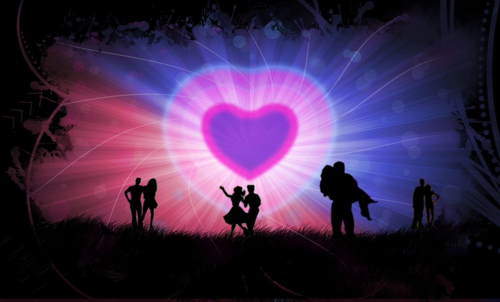
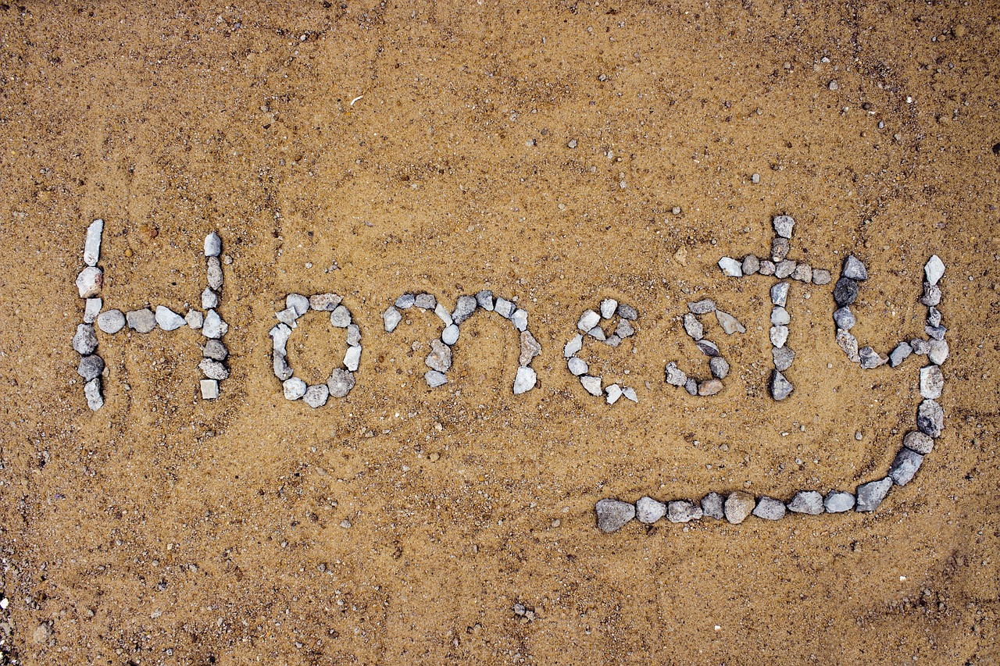
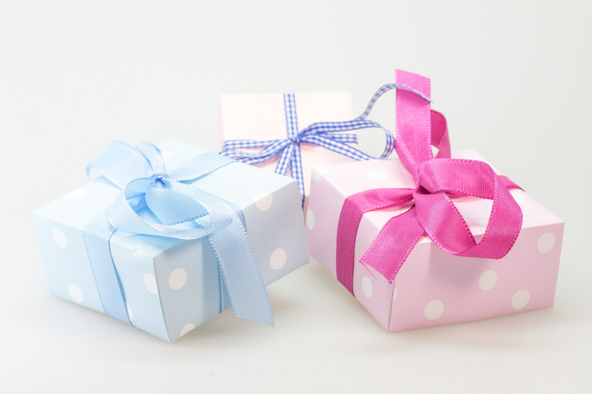
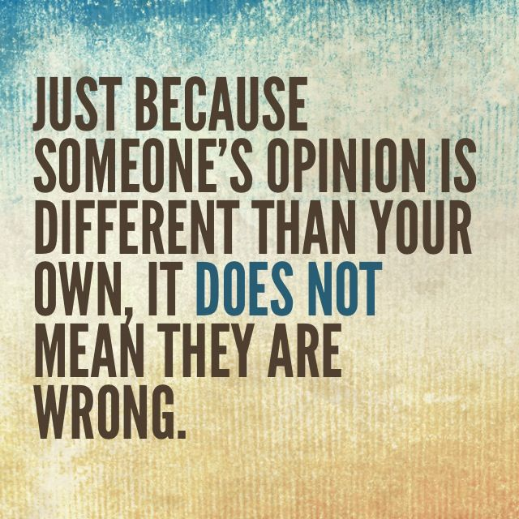
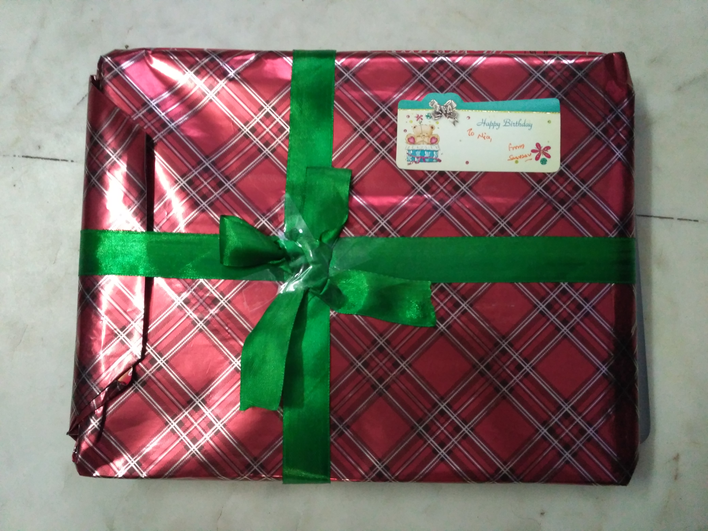

**How to maintain a healthy relationship with your friends and family?**
I am answering this question because lately I am trying my best to maintain a healthy relationship with my friends and family, and observed lot of things. Few say it is very hard to do so, though it is one of the easiest and simplest thing. Being in a healthy relationship doesn't mean you don't have any *issues,* it means **YOU** are working on them.

**Does distance matters in a relationship?**
Well, **no,** it doesn't. No such constraints matter when you truly want to maintain a relationship.

**Do you need to stay in touch for a successful relationship?**
Again, I would say NO. At times, it creates a perplexing situation. You can't stay in touch with all your friends and family members every time. It doesn't mean you don't want to, however it is difficult to do so. You even need time for yourself too. You may feel *exasperated,* when you don't hear from them on sending messages but you never know how busy they are, so *don't come up with conclusions or give up on them.* You need to stay serene. I assure you, they didn't forget you. A healthy relationship is built on trust, so it doesn't require a consistent reminder or touch to maintain it.

**Sometimes, you feel that your name is fade into oblivion when you are not in touch for a long time?**
Yes, it's true that people do forget you.

**How does it make you feel? Does it make you sad or depressed?**
Every human being will be sad after knowing the truth of being forgotten. But that's not what I feel anymore because it is so programmed in brain. When you are not in touch with someone for a long time, you forget it. It happens with your favorite subject too, when I was kid I love to study maths however I don't recall most of the things that I am not in touch with now. During your childhood, you watched some TV shows and some of them your favorites too. The significant thing to note here is that you may not remember the **name** of favorite character, but you still remember his behavior and actions. So, people may forget you, but they never forget how you made them feel.

**How you maintain a healthy relationship?**
Follow these 7 simple rules:

A) Be honest with them. It doesn't mean that you will say that *"You are looking ugly today."*

B) Come up with **gifts,** instead of *excuses.* No one loves to listen to excuses, however everyone like gifts. 😈

C) Listen to them attentively. Not only hear them, listen them. Pay attention about what they are speaking.

D) Respect their choices and opinions. As said by Marcus Aurelius: "Examine men’s ruling principles, even those of the wise, what kind of things they avoid, and what kind they pursue."

E) Be polite and calm.

F) Make them **feel special** on their *birthdays, anniversaries, and whenever you get the chance.* Atleast don't forget these special dates. :)

G) And most importantly, keep showering **LOVE.**

The answers of above questions, are just by own personal experience on them and things may be different for you. I respect your ideas, views, and opinions on the same.

And yes, if you like my article and helpful for you for your **healthy relationship,** please leave a **thank you note.** It will *motivate* me to write more :)

Thank you for reading.

Spread love with AnMa! #FeelGood #ANMA

[Facebook](https://www.facebook.com/anxietymanager/)

[Twitter](https://twitter.com/anxiety_manager)
