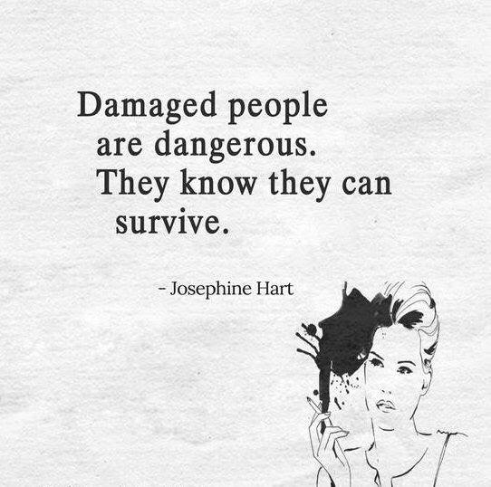

Two years ago, I was totally **damaged** in all aspects of life i.e., physically, mentally, socially, and financially. The *tears in my eyes* were clearly accentuated my condition. I had a feeling like I was stranded on an island. The *brooding look* of my face clearly illustrated that I wanted a *second chance* from my life to prove myself. The days and nights both were trying to prove that I should embrace this situation and quit everything.

Few days later, I was in my room and accepted the fact that I should give up. I started packing up my old works and projects. While packing up my stuff, I came across my *first project*, it was based on a story of a superhero. The image of that hero produced an ambivalent feeling in my body. It forced me to contemplate the meaning of my life again and filled my mind with one question. Did I really want to end everything? **NO** was the answer.

Now, if you think that the superhero story was the motivation, then you are wrong. Because, my motivation was nonetheless, it's only me. I just forgot my abilities because of the tough days, but that hero reminded me about the same. It showed me that I have the calibre of doing things. In the same way, instead of asking second chance from life, go and ask from yourself. And there is only one person, that can believe in you and see it yourself below:

With the above situation, I had nothing to lose and everything to earn. I was capable to take any level of risk; and that's what I did. My mind became rational from irrational. The trees where the only thorn were growing, now it's blooming with beautiful flowers and fruits. The destroyed life, taught many things to me.

1. How to survive in tough situations?
2. What can we achieve if we take risks?
3. The meaning of my life.
4. Instead of working on other dreams, we should work on our area of interests.
5. People will never forget you and vice versa. It's just you, when you are depressed you feel like that this is the end of world and cut out with others, but it isn't.

"Sooner or later, we all go through a crucible. Most believe there are two types of people who go into a crucible. The ones who become stronger from the experience and survive it, and the ones who die. But there's a third type. The ones who learn to love the fire and choose to stay in their crucible because it's easier to embrace the pain when it's all you know anymore."

So choose yourself.

**Metamorphism:**

At one of stage of my life, my fear and depression decided the fate of my life. However, today, I am the one who is ruling it. I morphed from a *damaged* to *happy* personality. And, I believe I am capable of follow the steps, that surely turns me into *successful* person in future. And hopefully, that day I would have earned so much that I have all the time to spend for myself and with my loved ones. They may or may not be with me, but the memories will always in 💖.

And yes, if you like the story, I request you to please leave a **thank you note.** It will *motivate* me to write more :)

Thank you for reading.

Spread love with AnMa! #FeelGood #ANMA

[Facebook](https://www.facebook.com/anxietymanager/)

[Twitter](https://twitter.com/anxiety_manager)
