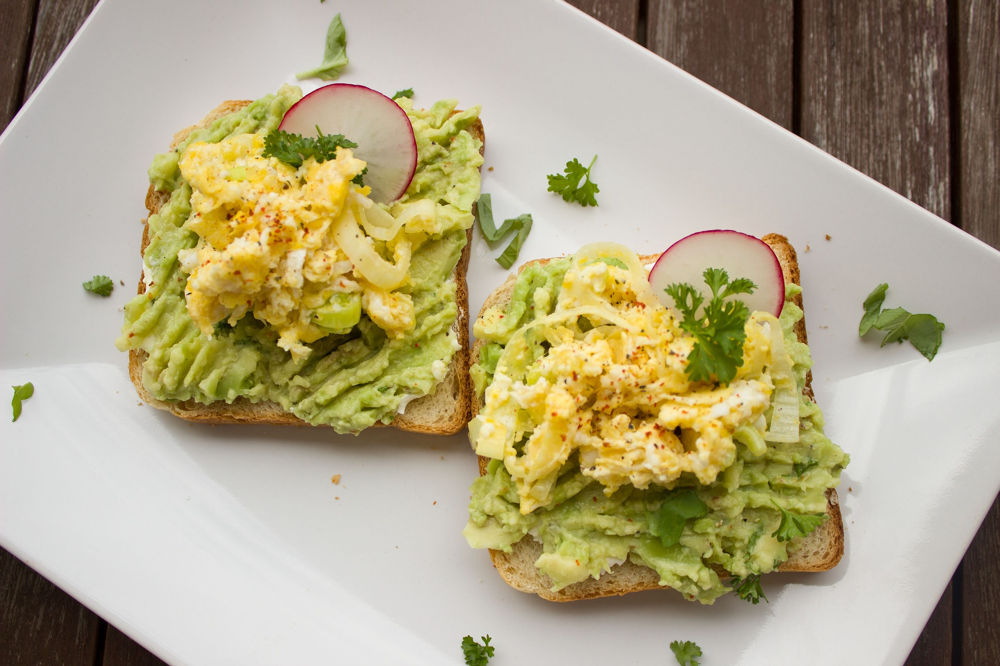

Hi everyone, let's start this post by a simple question:

**Ques: Do you love your breakfast and still miss it?**

Most of the people around me are skipping their breakfast and I am one of them, because of many reasons:

1) They have to work in shifts.

2) They wake up late, and prefer brunch as it saves their time.

3) Don't know how to cook.

4) Need to travel early morning.

5) Prefer fast foods or junk.

First of all, breakfast is not the meal that you have to eat early morning. It's the first meal that you need to consume after waking up regardless of timings, hence you should try not to skip it. If you wake up late, and prefer a brunch, then try to make a habit of waking up early, it won't cost you anything ;). If you don't know how to cook, go for salad it can be either fruit or vegetable :).

Do you remember those days when your mother used to cook breakfast for you on time, and you had a talent to avoid it as you found it boring. Yes, breakfast could be boring, however you have to understand the fact that if someone is waking up earlier than you and doing more boring stuff, i.e., cooking it for you then you should have respect that and enjoy that food, instead of avoiding and complaining about it.

And it is not only about the food, it is the meal sprinkled with love, joy, and happiness that makes you stronger, healthier, and happier. The only person that cooks for you, does really care about you. You must understand it as in near future, no one is going to cook for you other than yourself, or machines! haha.

I am writing this post, as I miss that love in my breakfast. I can cook breakfast, lunch, dinner, or anything for myself, however I can’t add the feeling of love in it. The food just fills my empty stomach.

And let me tell you one secret, when you eat that MEAL happily, it gives immense pleasure to cook. If not, the cook is always ready to try something new :). You can’t escape. Here cook can be anyone, your mother, wife, father, husband, friend or anyone.

Some tips for healthy breakfast:

1. Eat a banana as soon as you wake up, as it gives you energy boost.
2. Eat guava as it is highly rich in fibre
3. Eat nuts and berries
4. Eat pomegranate
5. Drink smoothie
6. Eat Muesli Cornflakes
7. Eat multigrain bread sandwich toast

Thank you for reading.

Spread love with AnMa! #FeelGood #ANMA

[Facebook](https://www.facebook.com/anxietymanager/)

[Twitter](https://twitter.com/anxiety_manager)
