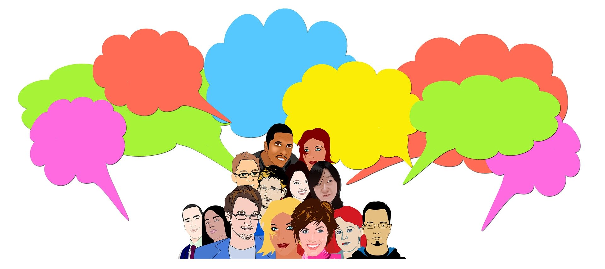
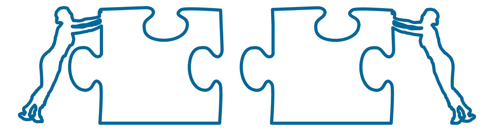
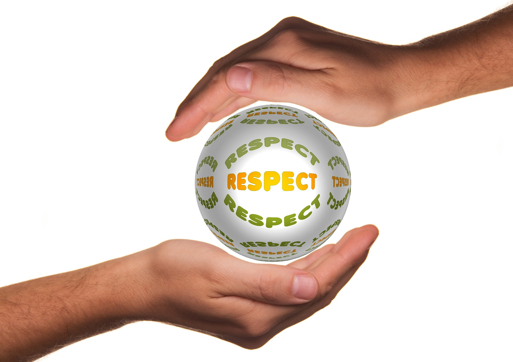
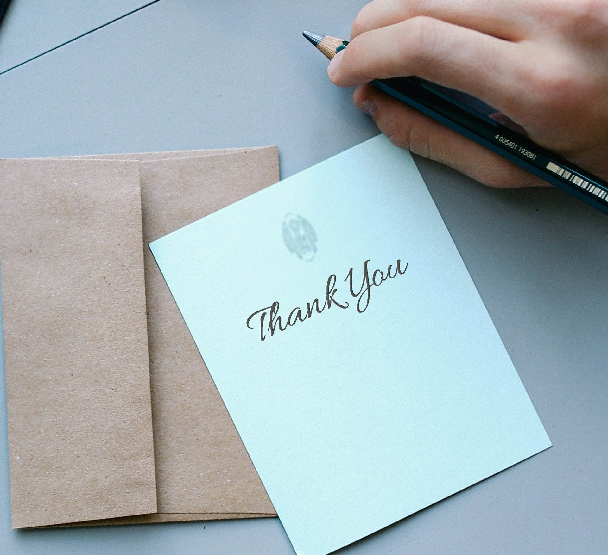

Just Three Words...
There are many things that you can do to strengthen your relationships. Often the most effective thing you can do involves saying just three words. When spoken sincerely, these statements often have the power to develop new
friendships, deepen old ones and even bring healing to relationships that have sourerd.

The following three-word phrases can be tools to help develop every relationship.

**1. Let me help**

Good friends see a need and then try to fill it. When they see a hurt they do what they can to heal it. Without being asked, they jump in and help out.

**2. I understand you**

People become closer and enjoy each other more when the other person accepts and understands them. Letting your spouse know - in so many little ways - that you understand them, is one of the most powerful tools for healing your relationship. And this can apply to any relationship.

**3. I respect you**

Respect is another way of showing love. Respect demonstrates that another person is a true equal. If you talk to your children as if they were adults you will strengthen the bonds and become closer friends. This applies to all interpersonal relationships.

**4. I miss you**

Perhaps more marriages could be saved and strengthened if couples simply and sincerely said to each other "I miss you." This powerful affirmation tells partners they are wanted, needed, desired and loved. Consider how important you would feel, if you received an unexpected phone call from your spouse in the middle of your workday, just to say "I miss you."

**5. Maybe you're right**

This phrase is very effective in diffusing an argument. The implication when you say "maybe you're right" is the humility of admitting, "may be I'm wrong". Let's face it. When you have an argument with someone, all you
normally do is solidify the other person's point of view. They, or you, will not likely change their position and you run the risk of seriously damaging the relationship between you. Saying "maybe you're right" can open the door to explore the subject more. You may then have the opportunity to express your view in a way that is understandable to the other person.

**6. Please forgive me**

Many broken relationships could be restored and healed if people would admit their mistakes and ask for forgiveness. All of us are vulnerable to faults, foibles and failures. A man should never be ashamed to own up that he has been in the wrong, which is saying, in other words, that he is wiser today than he was yesterday.

**7. I thank you**

Gratitude is an exquisite form of courtesy. People who enjoy the companionship of good, close friends are those who don't take daily courtesies for granted. They are quick to thank their friends for their many ex-pressions of kindness. On the other hand, people whose circle of friends is severely constricted often do not have the attitude of gratitude.

**8. Count on me**

A friend is one who walks in when others walk out. Loyalty is an essential ingredient for true friendship. It is the emotional glue that bonds people. Those that are rich in their relationships tend to be steady and true friends. When troubles come, a good friend is there indicating "you can
count on me."

**9. I'll be there**

If you have ever had to call a friend in the middle of the night, to take a sick child to hospital, or when your car has broken down some miles from home, you will know how good it feels to hear the phrase "I'll be there." Being there for another person is the greatest gift we can give. When we are truly present for other people, important things happen to them and us. We are renewed in love and friendship. We are restored emotionally and spiritually. Being there is at the very core of civility.

**10. Go for it**

We are all unique individuals. Don't try to get your friends to conform to your ideals. Support them in pursuing their interests, no matter how far out they seem to you. God has given everyone dreams, dreams that are unique to that person only. Support and encourage your friends to follow their dreams. Tell them to "go for it."

**Bonus: 11. I love you**

Perhaps the most important three words that you can say. Telling someone that you truly love them satisfies a person's deepest emotional needs. The need to belong, to feel appreciated and to be wanted. Your spouse, your children, your friends and you, all need to hear those three little words: "I love you." Love is a choice. You can love even when the feeling is gone.

And yes, if you like the article, I request you to please leave a **thank you note.** It will *motivate* us to write more :)

Thank you for reading.

Spread love with AnMa! #FeelGood #ANMA

[Facebook](https://www.facebook.com/anxietymanager/)

[Twitter](https://twitter.com/anxiety_manager)
