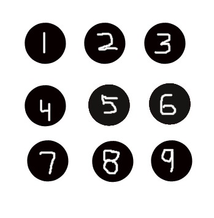
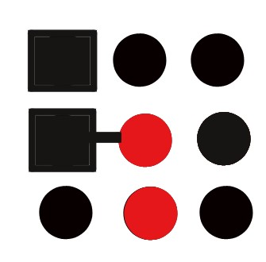

Everyday is a new opportunity to learn something *exciting*. However, it takes long time to `understand` them. In the previous three months of my adventure ride, I have learned something interesting that I'd like to share with everyone.

For better understanding, we will do one exercise. You must respond to the questions before we will discuss the conclusion.

The illustration below contains 9 objects, marked the positions from one through nine. And that is essentially how you can know where those objects are.



Now that we know the positions of those nine items, let's start our actual conversation. In the following picture, you must determine two objects that looks well connected with each other or form
the best pair based at first glance. The general observation for each image can be found at the bottom.

<h3>Image 1:</h3>


**Observation**: The best connected pair of 2 objects are at position 5 & 6, as they are of same color and can easily be distinguished from the rest. 

<h3>Image 2:</h3>


**Observation**: The best connected pair of 2 objects are at position 5 & 8, as they are of same size.


<h3>Image 3:</h3>


**Observation**: The best connected pair of 2 objects are at position 1 & 4, as they are of same size.

<h3>Image 4 (Interesting):</h3>


**Observation**: The best connected pair of 2 objects are at position 4 & 5, as they are connected with a bond.

<h3>Image 5 (Confusing):</h3>



**Observation**: The best connected pair of 2 objects are still at position 4 & 5, as they are connected with a bond.

<h3>Image 6 (Now, we know the rule):</h3>


**Observation**: The best connected pair of 2 objects are still at position 4 & 5, as they are connected with a bond.

We were discussing about the Gestalt Principle. Below, picture will make the things more clear.


<h3>Principle says:</h3> 
```text
Connectedness overrules size, shape, and color.
```

Now it's time for the fun or interesting part, `The Conclusion`. How it relates to the `real life`?

If we have a strong bond of `love, respect, trust, mutual understanding` in a team (dedicated to my team), or in any relationship then it doesn't matter about our shape, size or color as we will overrule all the problems of life that we are confronted with. The bond will make us stronger, and remember the problems will always be there. :-) `One of my favourite quote`:


```text
    Image Source: Magical Quote
    TV Show: Arrow (The CW)
    Character: Oliver Queen/Arrow
    Actor: Stephen Amell
```

And yes, if you like the article, I request you to please leave a **thank you note.** It will *motivate* us to write more :)

Thank you for reading.

Spread love with AnMa! #FeelGood #ANMA

[Facebook](https://www.facebook.com/anxietymanager/)

[Twitter](https://twitter.com/anxiety_manager)
